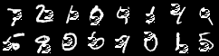

# Adversarial Patch Attack on MNIST Classifier

This project demonstrates a simple implementation of an adversarial patch attack against a Convolutional Neural Network (CNN) trained on the MNIST dataset. The goal is to generate a small, universal patch that, when applied to any input image, causes the model to misclassify it as a specific target class.

This implementation uses the **Expectation Over Transformation (EOT)** technique to create a patch that is robust to random translations, rotations, and scaling.

---

## Results

Here are the results of a successful attack. The goal was to make the model classify any digit as the target class.

### Attack Examples

The following images show the patch's effectiveness.

| Original Images | Fooled to Class '3' | Fooled to Class '4' | Fooled to Class '2' |
| :---: | :---: | :---: | :---: |
|  |  |  |  |

## Getting Started

Follow these instructions to set up the environment and run the project on your local machine.

### Prerequisites

- Python 3.8+

### Installation

1.  **Clone the repository:**
```bash
git clone https://github.com/MahsaNasehi/adversarial-patch-attack.git
cd adversarial-patch-attack
```

2.  **Create and activate a virtual environment:**
```bash
# For Windows
python -m venv venv
.\venv\Scripts\activate

# For macOS/Linux
python -m venv venv
source venv/bin/activate
```

3.  **Install the required dependencies:**
```bash
pip install -r requirements.txt
```

---

## Usage

The workflow is divided into three main steps: training the classifier, generating the patch, and evaluating the attack.

### 1. Train the MNIST Classifier

First, train the base CNN model. The trained weights will be saved to a file.
```bash
python train_model.py --save_path mnist_cnn.pth --epochs 5
```

### 2. Generate the Adversarial Patch

Next, use the trained model to generate the adversarial patch.

```bash
python src/train_patch.py --model_path models/mnist_cnn.pth --save_path models/mnist_patch.pth --target 2 --epochs 10
*This command will generate a patch that fools the model into predicting class `2`.*
```
---

## Project Structure

```bash
.
├── results/              # Directory for visualization outputs
├── src/                  # Source code for the project
│   ├── data.py           # MNIST data loaders
│   ├── model.py          # CNN model definition
│   ├── patch.py          # Functions for patch creation and application (EOT)
├── train_model.py    # Script to train the base classifier
├── train_patch.py    # Script to train the adversarial patch
├── .gitignore            # Files to be ignored by Git
├── requirements.txt      # Project dependencies
└── README.md             # This file
`
```
